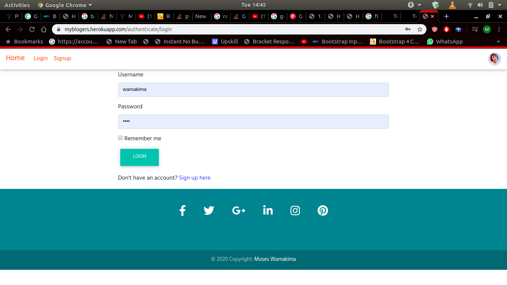
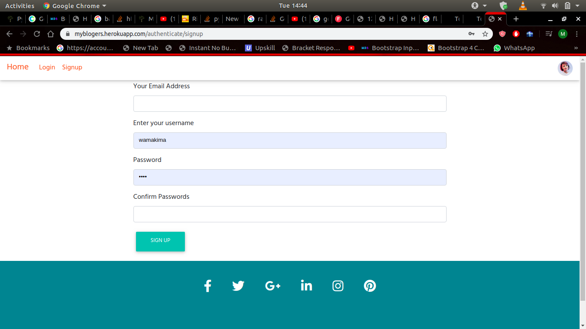
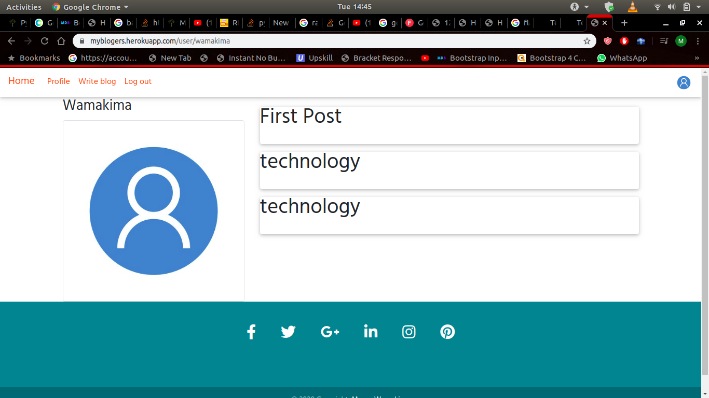
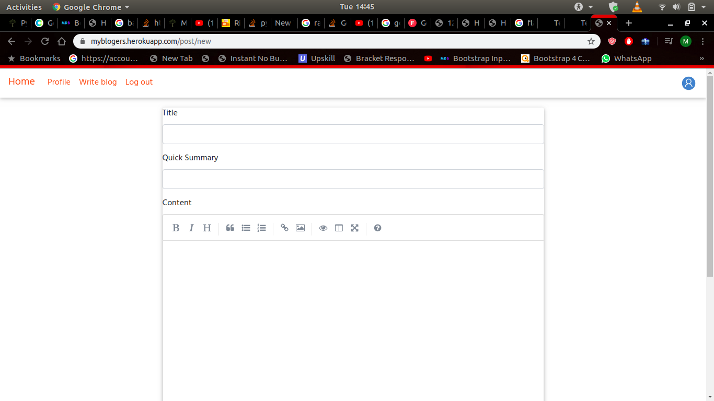

#                Blog App

A web app aplication for posting blogs and commenting on othe people's blogs.

## Created by [wamakimaN](https://github.com/wamakimaN)

## Description

It allows users to see posts made by other users and also post some themself.
Users create profiles if they dont have one already.
Users have the option of making a post or commenting on other peoples posts.

## B.D.D

* landing page

this is the first page a user sees

---

* Login page.

users sign in here if they have an account.

---

* Signup page.

if one does not have a profile they make one here

---

* Profile page.

users can now create posts or comment after login.

---

* create post.

---

## link

You can use the app [here](https://myblogers.herokuapp.com/)

## Installation

Clone this using the command below on your terminal:

$ git clone  https://github.com/wamakimaN/blogpost.git

* install python and the requirements in requirements.txt.
* run application by the command "./start.sh" in the terminal.

## Technologies Used

* Python 3.6
* Flask
* Jinja flask

## Known bugs

The posts appear from the first post ever posted to last. I would prefer if they started from the latest post.
Same case applies to the comments.

Any assistance on how to implement this will be highly appreciated.

## License

MIT (C) **[wamakimaN](https://github.com/wamakimaN)**
